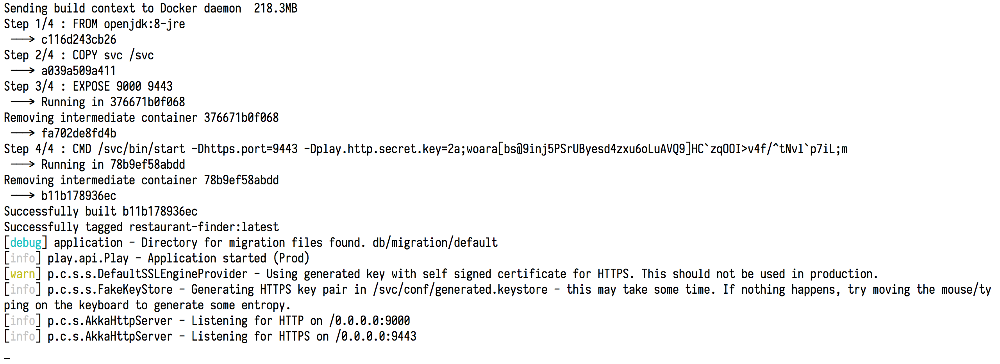
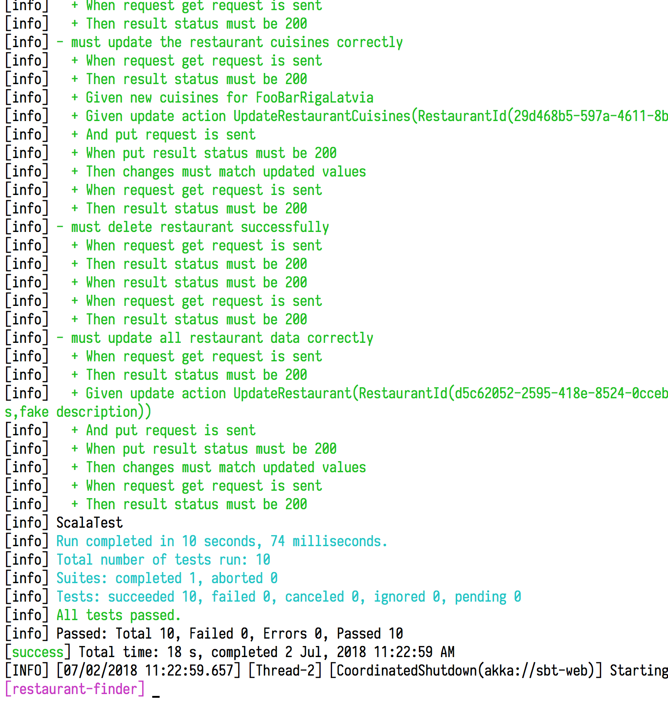
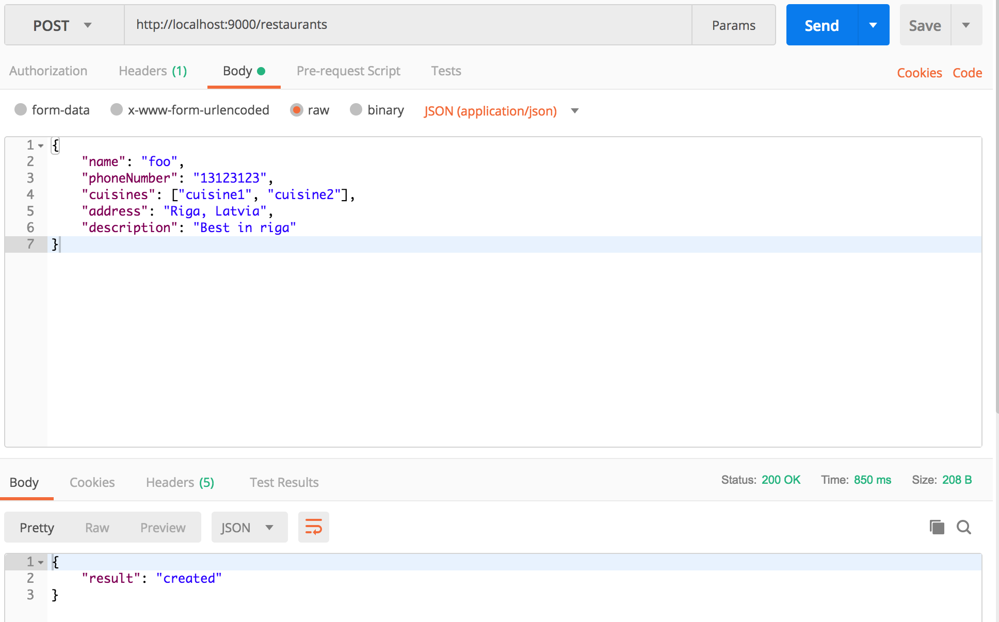

# Restaurant Finder micro-service

Built on top of playframework scala and slick

### Checklist

:white_check_mark: - Add code in the github under your user account

:white_check_mark: - Provide a simple README file that explains how to use the application, including simple documentation about your API

:white_check_mark: - Use unit testing to test the various components of the application

:white_check_mark: - Ensure that the api responds with proper json  error codes and responses

:white_check_mark: - Use async code throughout

:white_check_mark: - Use a logger instead instead of print

:white_check_mark: - Use docker build and start the application

:white_check_mark: - Add a simple application health check endpoint /v1/healthcheck


### Libraries used

    1. Circe json
    2. Monix task (better alternative to Futures)
    3. Slick (Database library)
    4. Shapeless
    5. H2 database (postgres dialect)
    6. Cats-core (functional programming library)
    7. Flyway database migration
    8. Scala test for tests

### Docker

To run on docker, ensure docker system daemon is running on your system

go to the project root

```bash
> ./docker.sh
```

If `docker.sh` has no execute permission then do

```bash
> chmod +x docker.sh
> ./docker.sh
```




### Instructions

1. Compiling the project

   `sbt compile`

2. Compiling the project tests

   `sbt test:compile`

3. Run project

   `sbt run`

4. Run tests

   `sbt test`


### Interesting code snippet

Exception to Http status codes and responses mapping. One place for all exceptions

```scala
def handleAppException(ex: AppException): PlayResult = {
    Logger.error(ex.getMessage)
    ex match {
      case ex: ValidationException => BadRequest(HttpFailure(ex.getMessage).asJson)
      case ex: ResourceNotFoundException => NotFound(HttpFailure(ex.getMessage).asJson)
      case ex: RuntimeServerException => InternalServerError(HttpFailure(ex.getMessage).asJson)
    }
  }

```

### Routes

```scala
package router


import java.util.UUID

import controllers.{Assets, RestaurantsController}
import play.api.routing.{Router, SimpleRouter}
import play.api.routing.sird._

class RestaurantFinderRouter(restaurantController: RestaurantsController,
                             assetsController: Assets) extends SimpleRouter {
  def routes: Router.Routes = {

    case GET(p"/") => restaurantController.index

    case GET(p"/v1/healthcheck") => restaurantController.healthCheck

    case GET(p"/restaurants/${uuid(id)}") => restaurantController.restaurant(id)

    case GET(p"/restaurants") => restaurantController.allRestaurants

    case POST(p"/restaurants") => restaurantController.createRestaurant

    case PUT(p"/restaurants") => restaurantController.updateRestaurant

    case DELETE(p"/restaurants/${uuid(id)}") => restaurantController.deleteRestaurant(id)

    // static resources
    case GET(p"/assets/$file*") =>
      assetsController.versioned(path = "/public", file)

    case GET(p"/$file*") =>
      assetsController.versioned(path = "/public", file)
  }

  val uuid = new PathBindableExtractor[UUID]
}
```

### REST API

### Create Curl request

```bash
curl -X POST \
  http://localhost:9000/restaurants \
  -H 'Cache-Control: no-cache' \
  -H 'Content-Type: application/json' \
  -d '{
	"name": "foo",
	"phoneNumber": "13123123",
	"cuisines": ["cuisine1", "cuisine2"],
	"address": "Riga, Latvia",
	"description": "Best in riga"
}'
```

response:

```json
{
    "result": "created"
}
```

### All restaurants

```bash
curl -X GET \
  http://localhost:9000/restaurants \
  -H 'Cache-Control: no-cache' \
  -H 'Content-Type: application/json'
```

response:

```json
{
    "result": [
        {
            "id": {
                "value": "5e8fbe6a-58b0-4de9-a3ce-6520ca75b382"
            },
            "name": "foo",
            "phoneNumber": "13123123",
            "cuisines": [
                {
                    "id": {
                        "value": "0d42e395-90e7-4822-9495-491d0184d891"
                    },
                    "name": "cuisine1"
                },
                {
                    "id": {
                        "value": "13bcde1a-f6fc-44c0-b5d3-81572f44f7fd"
                    },
                    "name": "cuisine2"
                }
            ],
            "address": "Riga, Latvia",
            "description": "Best in riga"
        },
        {
            "id": {
                "value": "0d517228-d771-45b7-b7c6-aa18625a44cd"
            },
            "name": "Best in Berlin",
            "phoneNumber": "123123123",
            "cuisines": [
                {
                    "id": {
                        "value": "be641950-9926-4261-9fac-9cd855716ebf"
                    },
                    "name": "cuisine111"
                },
                {
                    "id": {
                        "value": "c2fdde33-c316-4e1e-b613-cecf956958cd"
                    },
                    "name": "cuisine211"
                },
                {
                    "id": {
                        "value": "d63ae786-b315-4073-a57a-7a4fd4e9c925"
                    },
                    "name": "foo1"
                },
                {
                    "id": {
                        "value": "7f5a75aa-c615-409e-85a8-754af35e9694"
                    },
                    "name": "bar1"
                }
            ],
            "address": "Berlin",
            "description": "Best in Berlin"
        }
    ]
}
```

### Get restaurant by id

```bash
curl -X GET \
  http://localhost:9000/restaurants/5e8fbe6a-58b0-4de9-a3ce-6520ca75b382 \
  -H 'Cache-Control: no-cache' \
  -H 'Content-Type: application/json'
```

response:

```json
{
    "result": [
        {
            "id": {
                "value": "5e8fbe6a-58b0-4de9-a3ce-6520ca75b382"
            },
            "name": "foo",
            "phoneNumber": "13123123",
            "cuisines": [
                {
                    "id": {
                        "value": "0d42e395-90e7-4822-9495-491d0184d891"
                    },
                    "name": "cuisine1"
                },
                {
                    "id": {
                        "value": "13bcde1a-f6fc-44c0-b5d3-81572f44f7fd"
                    },
                    "name": "cuisine2"
                }
            ],
            "address": "Riga, Latvia",
            "description": "Best in riga"
        }
    ]
}
```

### Delete by id

```bash
curl -X DELETE \
  http://localhost:9000/restaurants/5e8fbe6a-58b0-4de9-a3ce-6520ca75b382 \
  -H 'Cache-Control: no-cache' \
  -H 'Content-Type: application/json'
```

response:

```json
{
    "result": "deleted"
}
```

### Update address/name/phoneNumber/description

Same json request body structure for address, name, phoneNumber, description.
Only change json key to others (phoneNumber instead of address).

```bash
curl -X PUT \
  http://localhost:9000/restaurants \
  -H 'Cache-Control: no-cache' \
  -H 'Content-Type: application/json' \
  -d '{

	"id": {
		"value": "0d517228-d771-45b7-b7c6-aa18625a44cd"
	},
	"address": "Zemuksa iela 10"
}'
```

response:

```json
{
    "result": "updated address"
}
```

### Update Cuisines

```bash
curl -X PUT \
  http://localhost:9000/restaurants \
  -H 'Cache-Control: no-cache' \
  -H 'Content-Type: application/json' \
  -H 'Postman-Token: c4ea053e-89e7-491e-a47b-348ff17c994b' \
  -d '{

	"id": {
		"value": "00f9b216-acba-438f-a1dd-504a179e39f0"
	},
	"cuisines" : [
		"hello",
		"world",
		"foo",
		"bar"
		]
}'
```

response:


```json
{
    "result": "updated cuisines"
}
```

### Update all properties at once

```bash
curl -X PUT \
  http://localhost:9000/restaurants \
  -H 'Cache-Control: no-cache' \
  -H 'Content-Type: application/json' \
  -d '{

	"id": {
		"value": "00f9b216-acba-438f-a1dd-504a179e39f0"
	},
	"data": {
		"name": "foo bar foo bar foo bar",
		"phoneNumber": "13123123",
		"cuisines": ["cuisine11", "cuisine21"],
		"address": "Riga, Latvia",
		"description": "Best in riga"
	}
}'
```

response:

```json
{
    "result": "updated"
}
```


### Screenshots





### Code snippets


```scala
package services

import common.results.Result
import database.tables.restaurantcuisines.RestaurantCuisinesRepo
import domain.Restaurant
import domain.actions._
import domain.query.{AllRestaurants, Query, Restaurants}
import exceptions.RestaurantIdNotFound
import monix.eval.Task
import play.api.Logger

trait RestaurantsService {
  def apply(action: Action): Result[String]
  def apply(query: Query): Result[Seq[Restaurant]]
}

class RestaurantsServiceImpl(repo: RestaurantCuisinesRepo) extends RestaurantsService {
  override def apply(action: Action): Result[String] = action match {
    case CreateRestaurant(data) => repo.saveRestaurantData(data).map(_ => "created")
    case updateAction: UpdateAction => updateAction match {
      case UpdateRestaurant(id, data) => repo.updateRestaurant(id, _ => data).map(_ => "updated")
      case UpdateRestaurantName(id, name) => repo.updateRestaurant(id, _.copy(name = name)).map(_ => "updated name")
      case UpdateRestaurantPhoneNumber(id, phoneNumber) =>
        repo.updateRestaurant(id, _.copy(phoneNumber = phoneNumber)).map(_ => "updated phone number")
      case UpdateRestaurantCuisines(id, cuisines) =>
        repo.updateRestaurant(id, _.copy(cuisines = cuisines)).map(_ => "updated cuisines")
      case UpdateRestaurantAddress(id, address) =>
        repo.updateRestaurant(id, _.copy(address = address)).map(_ => "updated address")
      case UpdateRestaurantDescription(id, description) =>
        repo.updateRestaurant(id, _.copy(description = description)).map(_ => "updated description")
    }
    case DeleteRestaurants(ids) => repo.deleteRestaurants(ids).map(_ => "deleted")
  }
  override def apply(query: Query): Result[Seq[Restaurant]] = query match {
    case AllRestaurants => repo.allRestaurants
    case Restaurants(ids) => repo.restaurantByIds(ids).flatMap { items =>
      if (items.isEmpty) {
        Logger(classOf[RestaurantsServiceImpl]).info("requested resource is not found")
        Task.raiseError(RestaurantIdNotFound(s"Requested resource not found"))
      } else Task.now(items)
    }
  }
}

```